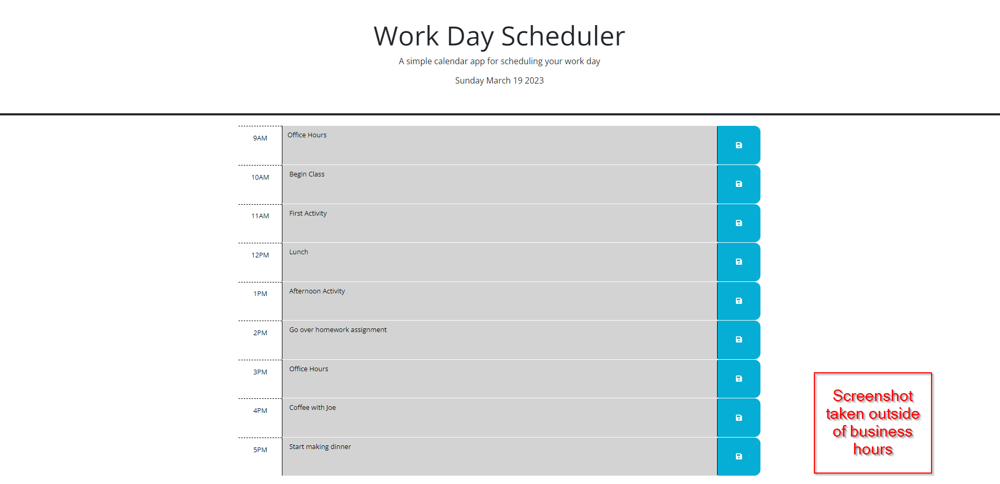

# Work Day Scheduler
---

## Site Description  
---

The Work Day Planner app allowers users to schedule their work day by entering appointments in the appropriate text boxes and clicking the corresponding Save button. Hours that have already past are denoted by a grey background, the current hour is highlighted in red, and future hours are green in color. If the user navigates away from the page or refreshes, the appointment persist. Additionally, the current date is always displayed at the top of the page.

## Screenshot  
---

## Deployed Site  
---

[Work Day App](https://ejseader.github.io/work-day-scheduler)
